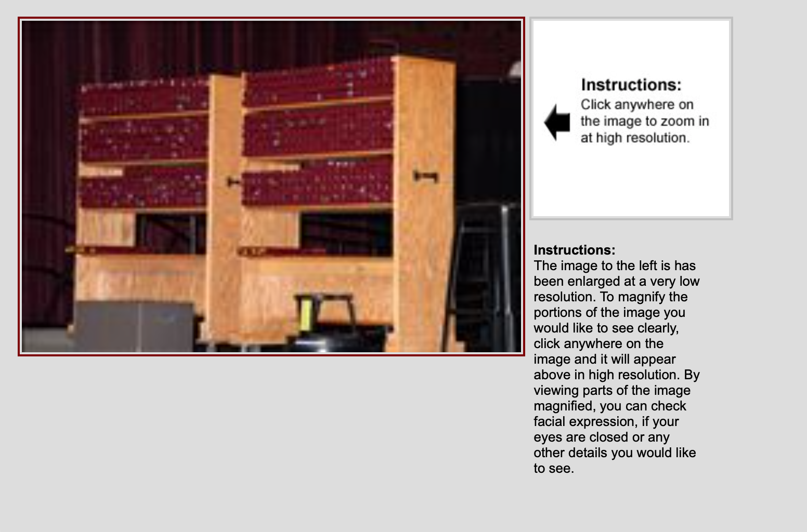
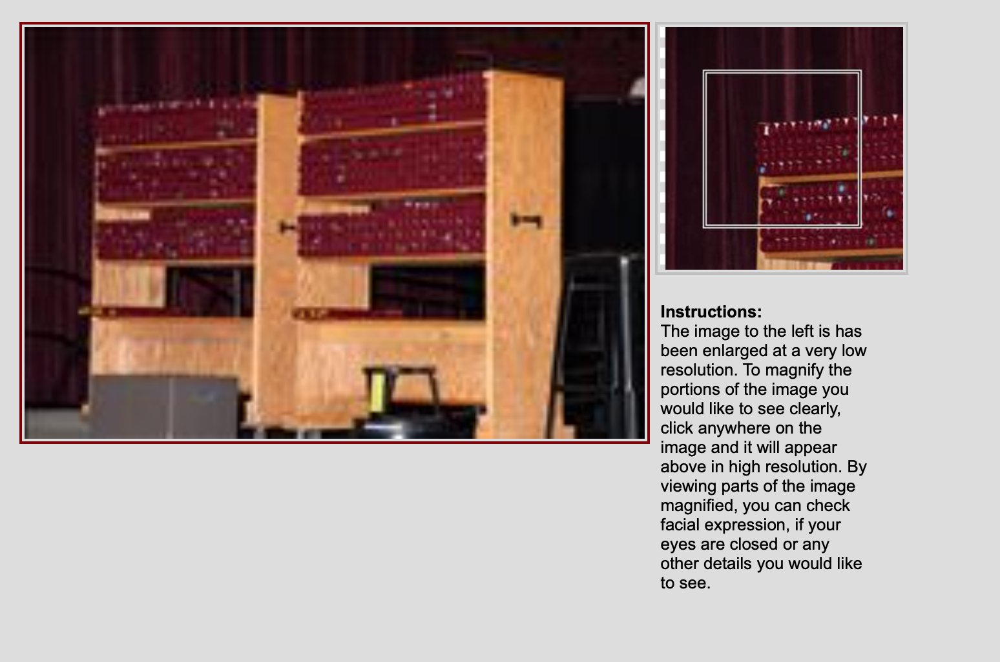
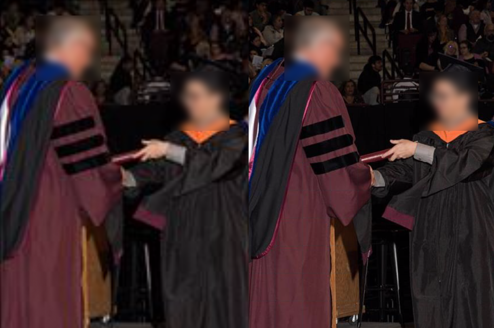
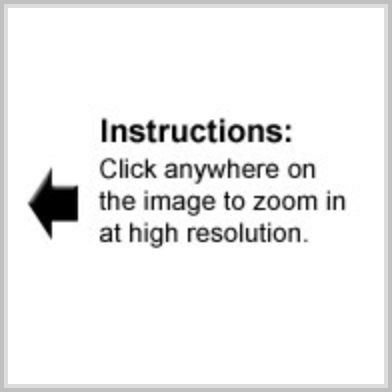
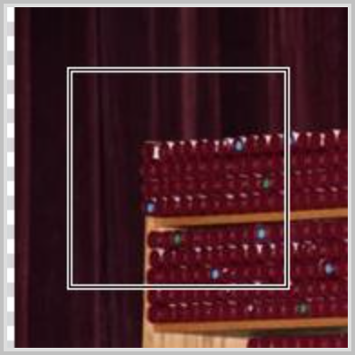
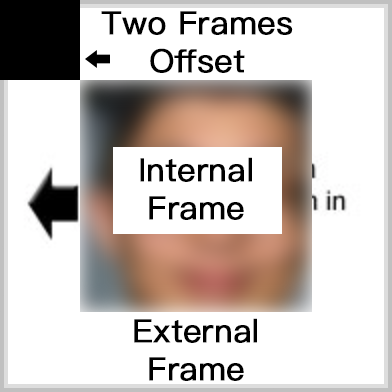
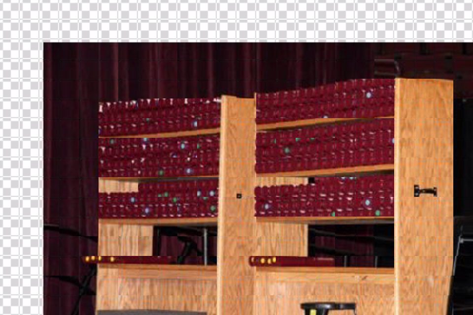
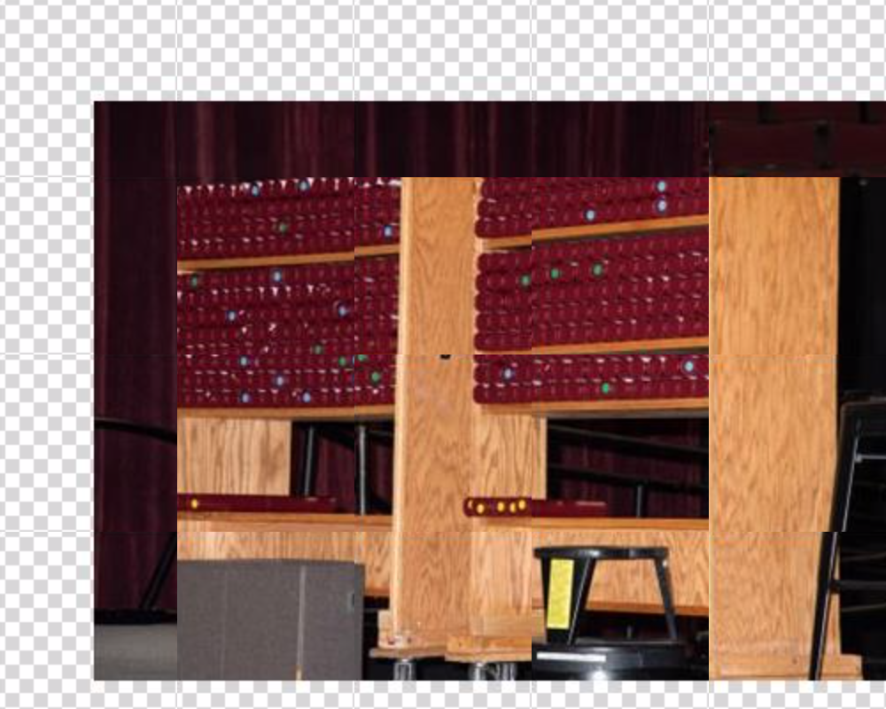
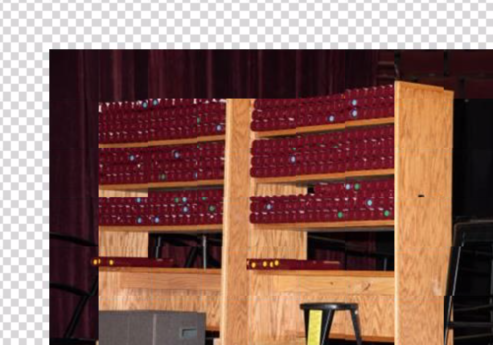

# Automatic-Screenshot-Take-Scroll-Stitch
### Introduction

There are a lot of websites that use server side rendering to only show part of the hi-res photo, in order to ask the users to pay for the photo, this is a script that automatically move cursor, do click, scroll action, and then take screenshots, and stitch them together to have the hi-res photo.

**Claim: Neither this script or its author(myself) has the intention to get the copyright photo from anyone or any organization, the code is used as academic purpose and it is neutral, the one who used the code will take full responsibility of any consequence it may cause.**


### Example

Below is a website that used server-side rendering technology to hide the hi-res photo, it shows a compressed, low-res photo and only when you clicked, the right preview window gives a part of a relatively high-res photo:





This script will automatically move the cursor, and take the screenshot on the frame area, and merge the results to a single image as:



The example seems perfect but due to the compression (jpeg probably) returned by the server, there are still visible merging grid on the image, but it is useable for online post (such us Instagram).


### Prepare the Environment

##### Install Required Modules

The script is tested on Python 3 environment, and before you proceed, please install required modules using terminal and PIP:

```
For Windows:
No need to install any modules.

For macOS (OS X):
sudo pip3 install pyobjc-framework-Quartz
sudo pip3 install pyobjc-core
sudo pip3 install pyobjc

For Linux:
sudo pip3 install python3-xlib
sudo apt-get install scrot
sudo apt-get install python3-tk
sudo apt-get install python3-dev

Then for all platforms:
sudo pip install pyautogui
sudo pip install pynput
sudo pip install pyscreenshot
```

##### Define Frame Area

Then there are some parameters and files you need to change for the script to work, first thing is to define the frame area. For the website above, you can see what I defined, are two frames, the external one and internal one, the reason is that, before you actually click anything on the low-res preview, the entire external frame is



Which is convenient for the script to locate, but, when you click on the low-res preview, the actually frame is



There is a border inside, so we what really want is the area inside the border, so we need to define a internal frame that has the same size of the internal area without the border for the script to know, it is the area to take the screenshots.


So, before you begin using the script, you need to do similar to what I did, to define an external for the script to detect the frame, and then a internal frame for the script to know where it should take the screenshots, so **the external frame is very important**, and must be the **same as the default frame area**, but the internal frame could simply be any image that has the size equal to the internal area for the script to calculate, and **you're free to modify this part according to the website as you need**.


The external frame file is `frame.png`, the internal frame file is `internal_frame.png`, I also attached a PSD file for you as reference to understand:



**Adjust Parameters:**

Open the `main.py`, scroll down to the `main() ` class, you will see several parameters for you to change and the explanations, I'll briefly explained here:

`dpi_scale`

Commonly a lot operating systems now use DPI scaling for hi-res screen, such as retina for Mac, this parameter is very important to correctly locate the frame and the mouse click, usually if you're using Desktop Windows with regular screen or a laptop without hi-res screen, or any DPI scaling if you know, set this to `1`, if you're using recent iMac/MacBook Pro or any retina display Macs, set to 2, or if you know the DPI scaling you set, enter the value here.

`scan_window_size`

This is to decide how far the cursor click the low-res area, usually small or equal to the internal frame size, but, **large value may lead to visible grid on the image**, so try use a smaller number. However, if you change it to a too small value, it will take a significant time to finish the screenshots taking, also the result may not be even better because the website I'm trying to use on, has a random function to randomly change the position of the hi-res preview, so no matter what you do, there will be a little offs, so I used `50` here, but **you're free to change and try**, I did a comparison here:

`scan_window_size = 20`



`scan_window_size = 50`



`scan_window_size = 100`



But for the first example photo, `50` looks perfect enough, so please wisely change this parameter.

`delay`

This is to decide how long the cursor will wait until move to the next point and click, the problem I have is that, the hi-res image is stored on the server, and it only return the preview image when you click to send out the request, so it means, **if the server is busy or, the internet connection is not good, the cursor may be automatically moved and clicked, but the image is not changed, which will lead to a messed-up result**, so change this based on your environment (In the **unit of second**).

` confidence_factor`

This is a factor that used for script to decide how confident it can decide the frame is detected on your screen. The problem is that, sometime there is color difference on different screens (or a single computer with different color profiles), to find a pixel-pixel match usually difficult, so by introducing a confidence factor, the script can better decide. When it sets really low, the script will detect irrelevant area and caused wrong position of the frame when take screenshots, so I used `98` here, which is perfect for my environment, **please do not change this unless you have problem for the script to find the frame location**.


### Run the Script

1. Run the `main.py`

2. Open the web page for the script to detect the frame, if succeeded, console will print

	`Frame detected! (578.0, 105.0, 114.0, 82.0)`

	The values are the **top left x and y coordinates of the internal frame**, the **width of the internal frame**, and the offset, which is the **distance between external and internal frames**.

3. If succeeded, it will prompts you to `Press Ctrl to start.`, when you press control key, it will ask you to **click the top left corner of the low-res preview area**, then the **bottom right corner**, in order to **let the script knows, where to move and click the cursor**.

4. After you set up the two points, **Don't touch the cursor**, the script will begin moving the cursor, and click, take the screenshots, you will see the cursor is moving automatically.

5. When finished, it will show you a preview of the result, and **the result has been saved onto the disk in `result.png`** , to the same folder of script.

### Other Problems and Solutions:

- If same parameters produce correct result on non-retina screen, but leaves grid (border) on retina, please change the `internal_frame.png` by shrinking it for several pixels, this problem is caused by up-scaling.

### Other Information

`frame_detection_assets` 

Contains pre-defined files for frame detection, both DPI = 1 and DPI =2 for retina.

`stitch.py`

This file does the regular screenshots taking and stitching, is a practice for me when writing the `main.py`.

`test.py`

Also when I write some functions and I would like to test it before I put it into the `main.py`, I do it here.

##### Console Print Out

If the script run successfully, it will print similar content in the console like this:

```bash
Press Ctrl + C to quit.
 Please open the webpage for frame detection...
Frame detected! (569.0, 105.0, 114.0, 82.0)
Press Ctrl to start.
Click the top left corner to get coordinates.
Click the bottom right corner to get coordinates.
Top left and bottom right:  [46, 71] [517, 692]
Box coordinates:  [46, 71] [517, 71] [46, 692] [517, 692]
Total  130  screenshots to be take.
Horizontally:  10 , vertically:  13 .
Begin taking screenshots...
Begin merging all screenshots...
Merged result has been saved to result.png .
```

